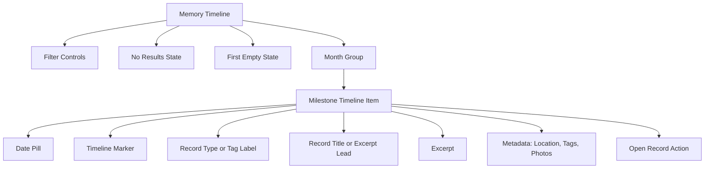
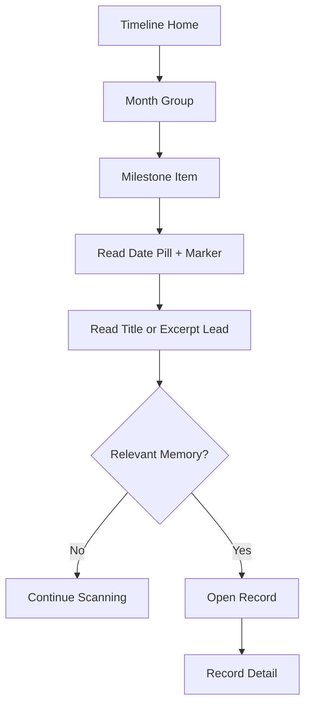

# Memory timeline milestone UI specification

## Introduction

This document defines a focused UI specification for evolving the populated
memory timeline into a clearer vertical milestone timeline. It is based on the
previous `*scan` of Cruip's "Example #1: The Milestone Timeline" and adapts the
pattern to the existing Life Memory Timeline product constraints.

Source reference:
https://cruip.com/3-examples-of-brilliant-vertical-timelines-with-tailwind-css/

This specification only covers the visual treatment of the populated timeline
items in `resources/views/livewire/memory/memory-timeline.blade.php`. It does
not change timeline query behavior, tenant scoping, filtering, localization,
record editing, media authorization, or route structure.

## Overall UX goals and principles

### Target user personas

- **Missionary owner:** Revisits mission experiences by date and quickly opens
  a full record when a timeline item feels relevant.
- **Family collaborator:** Scans private workspace memories without needing a
  table, admin list, or dashboard-style surface.
- **Future life memory user:** Uses the same chronological pattern for
  meaningful personal or family periods beyond mission validation.

### Usability goals

- **Faster scanning:** Users can visually follow the timeline through date
  anchors, markers, month sections, and readable record summaries.
- **Stronger chronology:** Timeline items feel connected to a continuous
  vertical path instead of appearing as independent cards.
- **Private calm:** The UI remains restrained, neutral, and product-focused.
- **Responsive clarity:** The same information hierarchy works on mobile,
  tablet, and desktop without overlapping text or controls.
- **Existing behavior preservation:** Date, tag, location, photo count, and
  detail navigation continue to work as they do today.

### Design principles

1. **Chronology over card density:** The timeline line, date pill, and marker
   define the structure before borders or shadows.
2. **Memory-first, not notification-first:** Use the pattern for personal
   memories, not activity feed language or system event styling.
3. **Month grouping stays authoritative:** Keep month sections from the service
   payload and render records inside each month.
4. **Use project tokens:** Use `primary-*`, `slate-*`, existing typography, and
   existing focus states instead of importing new fonts or palettes.
5. **No new frontend architecture:** Keep the change in Blade and Tailwind
   utility classes unless repeated markup later justifies a Blade component.

### Change log

| Date | Version | Description | Author |
| --- | --- | --- | --- |
| July 1, 2026 | 0.1 | Added focused milestone timeline UI specification from Cruip scan. | Uma |

## Information architecture

### Screen inventory



### Navigation structure

**Primary navigation:** No change. The memory layout continues to provide the
workspace context, **Timeline**, create actions, profile or language access,
and dashboard escape path.

**Secondary navigation:** Timeline filters remain above the populated timeline.
The milestone treatment begins only after filter controls and active filter
labels.

**Breadcrumb strategy:** No change. Record detail and edit routes remain the
places for deeper navigation.

## User flows

### Scan and open a memory

**User goal:** Follow the timeline by date, identify a memory, and open the
full record.

**Entry points:** Memory timeline after profile setup, saved record redirect,
record detail back link, and filtered timeline state.

**Success criteria:** The user can scan month sections, read a concise record
summary, and open the detail view without losing the current mental model.



**Edge cases and error handling:**

- If a record has no title, lead with the existing timeline excerpt.
- If a record has no timeline date, keep the existing null-date guard and do
  not render an invalid `<time>` element.
- If a record has no location, tags, or photos, omit those metadata rows
  without leaving empty visual gaps.
- If filters return no records, keep the separate no-results state.

## Wireframes and layout

### Populated month section

**Purpose:** Present records as connected timeline moments under the existing
month grouping.

**Key elements:**

- Month heading with the existing localized month label.
- Vertical line scoped to the records in that month.
- Each record item with a date pill, marker, label, title or lead text, excerpt,
  metadata, and detail action.

**Interaction notes:** The entire item should not become one large link. Keep
the existing explicit **Open record** action for clarity and accessibility.

```text
JUNE 2026

    [Jun 12]  o  Diary
                 First week in the new area
                 We arrived in the evening and met the family...
                 Curitiba / family, arrival / 3 photos
                 [Open record]

    [Jun 08]  o  Period
                 Training conference
                 Four days of training and notes from the group...
                 Sao Paulo / conference
                 [Open record]
```

### Responsive behavior

- Mobile uses a left timeline rail and `pl-8`.
- Small screens and up reserve a left date column with `sm:pl-32`.
- The date pill sits above content on mobile and moves into the left column on
  larger screens.
- Text wraps naturally; no viewport-based font scaling is required.
- Touch targets stay at least `h-9` for secondary actions and `h-10` where
  current primary actions already use that size.

## Component library and design system

### Design system approach

Use the existing Blade and Tailwind CSS approach. Do not add a new dependency,
new font, or standalone design system package. If this markup appears in more
than one timeline surface later, extract it into
`resources/views/components/memory/timeline-item.blade.php`.

### Core components

#### Timeline month group

**Purpose:** Wrap records for one existing service-provided month group.

**Variants:** Populated only. Empty and no-results states stay separate.

**States:** Normal.

**Usage guidelines:** Render one section per `$timelineGroups` item. Preserve
`wire:key="timeline-group-{{ $group['month_key'] }}"`.

#### Milestone timeline item

**Purpose:** Render one memory record as a connected timeline moment.

**Variants:** Diary record and period record.

**States:** Normal, hover, focus-visible through the explicit action, and
metadata-present or metadata-empty.

**Usage guidelines:** Preserve
`wire:key="timeline-record-{{ $record->id }}"`, `timelineDate()`,
`timelineExcerpt()`, `timelinePhotoCount()`, tags, location, and the existing
route to `memories.records.show`.

#### Date pill

**Purpose:** Anchor the record in time while keeping the timeline scannable.

**Variants:** Single date and period range.

**States:** Normal only.

**Usage guidelines:** Render a semantic `<time>` only when `$timelineDate`
exists. For period records, include the current range separator and end date
inside the visible label.

#### Timeline marker

**Purpose:** Connect each item to the vertical rail.

**Variants:** Default memory marker. A future story may add type-based marker
colors, but this specification keeps one marker style.

**States:** Normal only.

**Usage guidelines:** Use pseudo-elements on the item header wrapper instead of
extra decorative DOM where practical.

## Branding and style guide

### Visual identity

Use the existing memory product direction from `docs/architecture.md`: neutral
surfaces, subtle borders, restrained accent color, and simple states.

### Color palette

| Color type | Token | Usage |
| --- | --- | --- |
| Primary | `primary-600`, `primary-700`, `primary-100` | Markers, date pill text, focus, and subtle accents. |
| Neutral text | `slate-950`, `slate-800`, `slate-700`, `slate-600`, `slate-500` | Headings, excerpts, metadata, and labels. |
| Neutral surface | `white`, `slate-50`, `slate-100` | Timeline background, tags, and soft item hover. |
| Border | `slate-200`, `slate-300` | Timeline rail, tag boundaries, and subdued separators. |
| Error | Existing project error tokens | No new timeline-specific error treatment. |

### Typography

| Element | Size | Weight | Line height |
| --- | --- | --- | --- |
| Month label | `text-xs` | `font-semibold` | Default |
| Date pill | `text-xs` | `font-semibold` | `h-6` control height |
| Item label | `text-xs` | `font-semibold` | Default |
| Item title | `text-base` or `text-lg` | `font-semibold` | `leading-6` |
| Excerpt | `text-sm` | Regular | `leading-6` |
| Metadata | `text-xs` | Regular or medium | Default |

Do not import the `Caveat` font from the reference implementation. The memory
product should continue using the application's existing typography.

### Iconography

No new icon library is required. The marker is a CSS dot. Existing actions may
remain text-only unless a later implementation story introduces project-local
icons consistently.

### Spacing and layout

Recommended Tailwind structure for each month:

```html
<section class="flex flex-col gap-3">
    <header>...</header>
    <div class="-my-4">
        <article class="group relative py-5 pl-8 sm:pl-32">...</article>
    </div>
</section>
```

Recommended line and marker wrapper:

```html
<div class="mb-2 flex flex-col items-start sm:flex-row
    group-last:before:hidden
    before:absolute before:left-2 before:h-full before:px-px
    before:-translate-x-1/2 before:translate-y-3 before:bg-slate-300
    before:self-start sm:before:left-0 sm:before:ml-[6.5rem]
    after:absolute after:left-2 after:h-2 after:w-2 after:rounded-full
    after:border-4 after:border-white after:bg-primary-600
    after:box-content after:-translate-x-1/2 after:translate-y-1.5
    sm:after:left-0 sm:after:ml-[6.5rem]">
```

Recommended date pill:

```html
<time class="mb-3 inline-flex h-6 w-20 translate-y-0.5 items-center
    justify-center rounded-full bg-primary-100 text-xs font-semibold
    uppercase text-primary-700 sm:absolute sm:left-0 sm:mb-0">
```

## Accessibility requirements

### Compliance target

**Standard:** WCAG 2.2 AA where applicable to this product surface.

### Key requirements

**Visual:**

- Maintain contrast for date pills, marker accents, metadata, and actions.
- Preserve existing focus-visible outlines on interactive controls.
- Avoid relying on marker color alone to communicate record type or state.

**Interaction:**

- Keep **Open record** as a real link with the existing named route.
- Ensure keyboard users can tab to the explicit action without traversing
  decorative marker elements.
- Keep date markup semantic with `<time datetime="...">`.

**Content:**

- Preserve localized labels and date formatting.
- Do not expose full private record bodies in timeline HTML when the excerpt
  helper already provides a bounded summary.

## Implementation notes

- Update only `resources/views/livewire/memory/memory-timeline.blade.php` for
  the first implementation pass.
- Preserve `MemoryTimelineService` as the tenant-scoped query boundary.
- Preserve URL-backed `from`, `to`, and `tag` filters and transient `location`.
- Keep no-results and first-empty states unchanged unless the implementation
  story explicitly includes them.
- Use `gap` utilities for sibling spacing and avoid margin chains where a
  parent gap can express the layout.
- Do not use deprecated Tailwind v3 opacity utilities.

## Acceptance criteria for the implementation story

1. Populated timeline records render as connected milestone items under each
   existing month section.
2. The visual line and marker do not appear after the final record in a month.
3. Date or period range remains visible and semantic for records with timeline
   dates.
4. Location, tags, photo count, excerpt, and **Open record** behavior remain
   functionally unchanged.
5. The timeline still passes existing Livewire and service tests for ordering,
   month grouping, filters, empty states, and tenant exclusion.
6. The UI remains responsive on mobile, tablet, and desktop without text
   overlap.
7. No Filament table, admin list, marketing hero, blog-card feed, map, masonry,
   or complex animation treatment is introduced.

## Validation plan

Run the focused checks that cover this surface:

```bash
vendor/bin/sail artisan test --compact tests/Feature/Livewire/Memory/MemoryTimelineTest.php
vendor/bin/sail artisan test --compact tests/Feature/Services/Memory/MemoryTimelineServiceTest.php
npm run lint
npm run validate:structure
```

