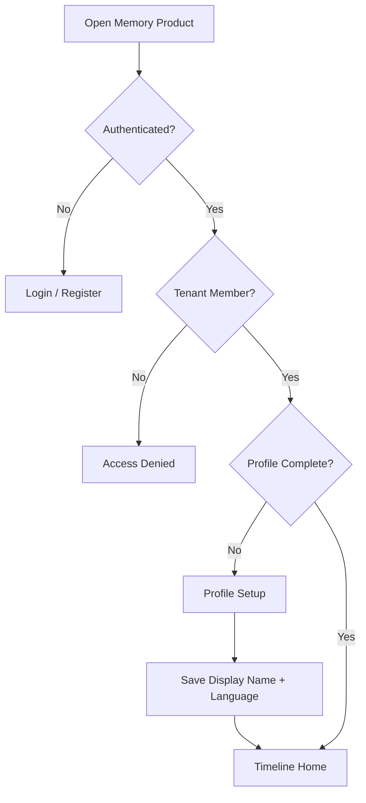
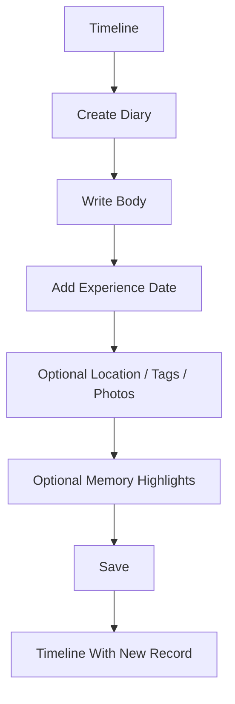
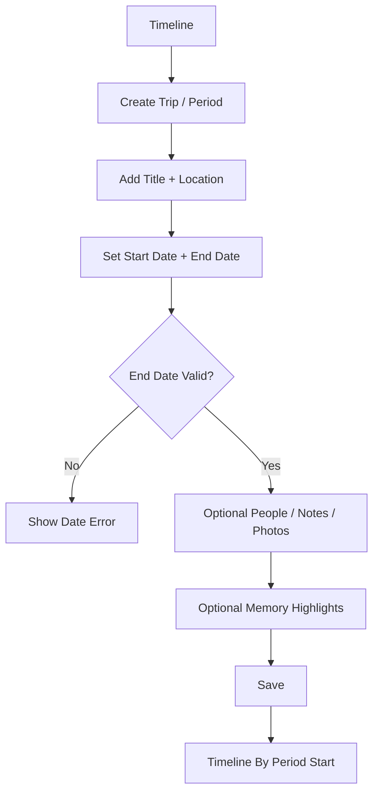
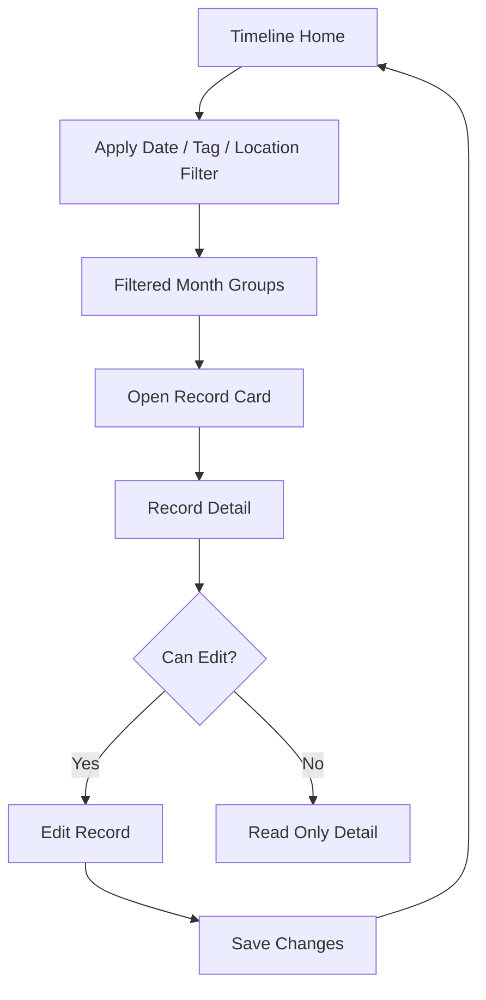

# Life Memory Timeline for Missionaries UI/UX specification

## Introduction

This document defines the user experience goals, information architecture, user
flows, and visual design specifications for Life Memory Timeline for
Missionaries. It serves as the foundation for visual design and front-end
development, ensuring a cohesive, private-first, timeline-centered, and
user-centered experience.

This specification focuses on the authenticated memory product surface under
`/memories/{tenant:uuid}`. It does not define public marketing pages, Filament
CRUD screens, album-generation UI, social feeds, maps, masonry timelines,
complex animation, AI extraction, or public sharing.

## Overall UX goals and principles

### Target user personas

- **Missionary owner:** Captures mission experiences quickly through diary
  records, trip/period records, photos, and Memory Highlights.
- **Family collaborator:** Revisits and contributes to private workspace
  memories without needing admin-style tools.
- **Future life memory user:** Uses the same timeline model for meaningful life
  periods beyond missions.

### Usability goals

- **Timeline-first aha moment:** After setup, users land on a calm,
  month-grouped memory timeline.
- **Fast capture:** Users can create a diary record without feeling forced into
  metadata administration.
- **Private confidence:** Records and photos consistently feel protected inside
  the family workspace.
- **Retrieval:** Users can find memories by date, tag, and location.
- **Localization tolerance:** English, Portuguese, and Spanish strings fit
  across navigation, filters, forms, cards, and states.

### Design principles

1. **Memory-first, not admin-first:** The product opens as a timeline, not a
   table, dashboard list, or CRUD surface.
2. **Write before organize:** Forms prioritize capturing the memory, then
   optional tags, photos, and highlights.
3. **Private by default:** Workspace privacy is visible through calm cues,
   without per-record visibility controls.
4. **Emotion with restraint:** The interface feels warm and meaningful without
   marketing hero patterns or heavy visual polish.
5. **Scalable foundation:** Use neutral memory language so the product can
   expand beyond missionaries.

### Change log

| Date | Version | Description | Author |
| --- | --- | --- | --- |
| May 18, 2026 | 0.1 | Initial UX specification from PRD, architecture, brief, and PM handoff. | Uma |

## Information architecture

### Site map and screen inventory

```mermaid
graph TD
    A[Authenticated Entry /memories/{tenant:uuid}] --> B{Memory Profile Complete?}
    B -->|No| C[Profile Setup]
    B -->|Yes| D[Timeline Home]

    C --> C1[Display Name]
    C --> C2[Preferred Language]
    C --> C3[Optional Mission Context]
    C --> D

    D --> D1[Month-Grouped Timeline]
    D --> D2[Filters: Date, Tag, Location]
    D --> D3[Empty State]
    D --> D4[Private Media States]
    D --> E[Create Diary Record]
    D --> F[Create Trip/Period Record]
    D --> G[Record Detail]

    E --> E1[Writing Body]
    E --> E2[Date, Location, Tags]
    E --> E3[Photos]
    E --> E4[Memory Highlights]
    E --> D

    F --> F1[Title, Location, Period]
    F --> F2[People, Notes]
    F --> F3[Photos]
    F --> F4[Memory Highlights]
    F --> D

    G --> G1[Read Full Record]
    G --> G2[Edit Record]
    G --> G3[Photo Viewer / Authorized Media]
    G2 --> E
    G2 --> F

    D --> H[Profile / Language Controls]
    D --> I[Account / Dashboard Escape]
    A --> J[Access Denied]
```

### Navigation structure

**Primary navigation:** Use a dedicated memory top bar with workspace
name/context, **Timeline**, **Create record**, profile/language access, and an
account/dashboard escape path.

**Secondary navigation:** Use timeline-level filters by date, tag, and
location. Keep record editor sections in one writing-first form instead of
separate admin tabs.

**Breadcrumb strategy:** Keep breadcrumbs minimal and contextual:
**Timeline** > **Record detail** > **Edit**. Create flows must return clearly to
the timeline after save. Avoid deep dashboard-style navigation.

## User flows

### First memory entry

**User goal:** Complete setup and reach the timeline without encountering admin
UI.

**Entry points:** `/memories/{tenant:uuid}`, post-registration redirect, and
dashboard escape link.

**Success criteria:** The user saves display name and language, then lands on
the month-grouped timeline.



**Edge cases and error handling:**

- Unauthenticated visitors are redirected to authentication.
- Non-members see access denied without tenant content.
- Missing required profile fields keep the user on setup with clear
  validation.
- Language changes update UI copy without translating user content.

### Create diary record

**User goal:** Capture a meaningful experience quickly.

**Entry points:** Timeline empty state, **Create record** menu, and timeline
action.

**Success criteria:** The diary record saves with body and experience date.
Optional metadata does not block capture.



**Edge cases and error handling:**

- Body and experience date are required.
- Photo limits are explained before or during upload.
- Highlight rows can be added, removed, reordered, or left empty.
- Save failure preserves draft state in the form where feasible.

### Create trip or period record

**User goal:** Add a multi-day memory to the same timeline.

**Entry points:** **Create record** menu and timeline empty-state secondary
action.

**Success criteria:** The trip/period record saves with title, start date, and
end date, then appears by period start date.



**Edge cases and error handling:**

- End date cannot be before start date.
- Missing title or dates block save with inline validation.
- Period records must not introduce extra record types or map/masonry UI.

### Browse, filter, and open record

**User goal:** Revisit a memory by time, tag, or location.

**Entry points:** Timeline home after setup, save redirect after record
creation, and record detail back link.

**Success criteria:** The user filters the timeline, opens a card, reads detail,
and can edit if authorized.



**Edge cases and error handling:**

- Empty filtered results offer a clear filter reset.
- Unauthorized record URLs return access denied without content leakage.
- Date changes update timeline placement.
- Private media failures show a protected-media state, not a broken public URL.

## Wireframes and mockups

**Primary design files:** No Figma file is defined yet. This specification is
the low-to-mid fidelity source for later visual design. If Figma is created,
frames should map directly to the screens below.

### Key screen layouts

#### Dedicated memory layout shell

**Purpose:** Provide an authenticated, tenant-aware product frame that feels
separate from Filament and public marketing.

**Key elements:**

- Compact top bar with workspace name, **Timeline** link, **Create** menu,
  profile/language control, and dashboard escape.
- Main content column optimized for reading and writing.
- Subtle private workspace cue near workspace context, not repeated on every
  record as a visibility label.

**Interaction notes:** On mobile, top navigation collapses into a compact menu
while keeping **Create record** and **Timeline** easy to reach.

**Design file reference:** TBD.

#### Memory profile setup

**Purpose:** Gate first-time memory product access and capture only
MVP-critical profile details.

**Key elements:**

- Display name field.
- Preferred interface language selector: English, Portuguese, and Spanish.
- Optional mission context field or short textarea.
- Primary action: continue to timeline.

**Interaction notes:** Keep this closer to an account setup form than a
marketing onboarding screen. Use no hero, feature tour, or album language.

**Design file reference:** TBD.

#### Timeline home

**Purpose:** Deliver the product aha moment: a private month-grouped memory
timeline.

**Key elements:**

- Month separators.
- Vertical record list ordered by experience date or period start date.
- Memory cards with date/period, optional location, excerpt, tags, primary
  photo or reserved media area, photo count, and open action.
- Filter controls for date, tag, and location.
- **Create diary** and **Create trip/period** actions.

**Interaction notes:** Filters should be compact and clear. The timeline
remains a vertical list, not masonry, map, table, admin list, or blog feed.

**Design file reference:** TBD.

#### Empty timeline

**Purpose:** Help users create the first meaningful record without
marketing-style onboarding.

**Key elements:**

- Calm empty-state message focused on preserving the first memory.
- Primary action: **Create diary record**.
- Secondary action: **Create trip or period**.
- Small private workspace reassurance.

**Interaction notes:** Use no feature checklist, public sharing prompt, or
album-generation promise.

**Design file reference:** TBD.

#### Diary record editor

**Purpose:** Make writing fast, then allow optional structure.

**Key elements:**

- Large body field as the dominant control.
- Experience date near the writing area.
- Optional location, tags, photos, and Memory Highlights.
- Dynamic Memory Highlights list with add/remove/reorder.
- Save and cancel/back actions.

**Interaction notes:** Required validation should appear inline. Optional
metadata should not visually compete with the writing field.

**Design file reference:** TBD.

#### Trip or period record editor

**Purpose:** Capture multi-day memories with structured fields faster than a
diary entry.

**Key elements:**

- Title.
- Location.
- Start and end date.
- People.
- Notes.
- Photos.
- Memory Highlights.

**Interaction notes:** Date validation must be immediate and clear when end
date precedes start date.

**Design file reference:** TBD.

#### Record detail

**Purpose:** Let workspace members read a full memory and access editing.

**Key elements:**

- Date or period header.
- Title when present.
- Full body or notes.
- Location, tags, people, and highlights.
- Photo area served through authorized media.
- Edit action when authorized.
- Back to timeline action.

**Interaction notes:** Detail should feel like reading a memory, not inspecting
a database record.

**Design file reference:** TBD.

#### Private media states

**Purpose:** Make photo upload/display feel trustworthy and bounded.

**Key elements:**

- Upload in progress.
- Attached photo thumbnails.
- Photo count.
- File limit feedback.
- Protected/unavailable media state.

**Interaction notes:** Never imply public URLs or public sharing. Broken media
should resolve to a private/protected state.

**Design file reference:** TBD.

#### Access denied and error states

**Purpose:** Protect privacy without leaking tenant or record content.

**Key elements:**

- Simple access denied message.
- Return to safe destination.
- No record title, photo, body excerpt, or tenant-private metadata.

**Interaction notes:** Error states should be calm and clear, not alarming or
technical.

**Design file reference:** TBD.

## Component library and design system

**Design system approach:** Use the existing Laravel Blade, Livewire, Tailwind
CSS, and DaisyUI stack, but create a restrained memory-product layer inside the
dedicated memory layout. Reuse existing primitives only when they can be styled
down to feel calm, private, and writing-first. Do not create a full new design
system for the MVP.

### Core components

#### Memory layout shell

**Purpose:** Authenticated product frame for the tenant-scoped memory surface.

**Variants:** Desktop top bar and mobile compact menu.

**States:** Default, active nav item, tenant access denied, and loading.

**Usage guidelines:** Use only for `/memories/{tenant:uuid}` product routes. Do
not mix with public marketing layout or Filament Dashboard chrome.

#### Timeline month group

**Purpose:** Separate records by month in the vertical timeline.

**Variants:** Current month, past month, and loading skeleton.

**States:** Default and loading.

**Usage guidelines:** Month grouping is the only MVP timeline grouping layer.
Use no maps, masonry, or complex animation.

#### Memory card

**Purpose:** Preview a diary or trip/period record in the timeline.

**Variants:** Diary, trip/period, with photo, without photo, and filtered
result.

**States:** Default, hover/focus, loading, and unavailable media.

**Usage guidelines:** Show date/period, optional location, excerpt, tags, photo
count, and open action. Avoid blog-card styling, hover scaling, heavy shadows,
and promotional imagery treatment.

#### Record editor form

**Purpose:** Create or edit diary and trip/period records.

**Variants:** Diary editor and trip/period editor.

**States:** Empty, dirty, saving, validation error, and saved.

**Usage guidelines:** Writing area or title/date fields should lead. Metadata
stays supportive and optional where allowed.

#### Memory Highlights list

**Purpose:** Let users save important names, scriptures, lessons, quotes, or
moments.

**Variants:** Empty list, populated list, and reorderable list.

**States:** Add, edit, remove, reorder, and validation error.

**Usage guidelines:** Keep human and lightweight. Do not expose AI
classification, inline annotation, or technical metadata language. Do not rely
on drag-only interactions. If reorder is supported, include keyboard-accessible
move up/down controls.

#### Timeline filter bar

**Purpose:** Filter by date, tag, and location.

**Variants:** Desktop inline and mobile stacked/collapsible.

**States:** Empty, active filters, no results, and reset available.

**Usage guidelines:** Filters refine the timeline without turning it into an
admin list. Active filters need visible text labels, not color alone.

#### Private media uploader and gallery

**Purpose:** Attach and display private photos.

**Variants:** Upload dropzone/input, thumbnail grid, detail gallery, and
protected media state.

**States:** Uploading, success, file too large, too many photos,
unauthorized/unavailable.

**Usage guidelines:** Communicate limits clearly. Never imply public sharing or
public URLs. Treat this as security-sensitive UI.

#### Record detail header and memory reading view

**Purpose:** Present a full memory in a reading-first view.

**Variants:** Diary, trip/period, with media, and without media.

**States:** Default, loading, editable, read-only, and protected/unavailable
media.

**Usage guidelines:** Prioritize date/period, title/body/notes, location, tags,
people, highlights, and authorized photos. Do not present as an admin detail
table.

#### Empty and error state panel

**Purpose:** Provide consistent feedback for empty timelines, no filtered
records, access denial, validation gaps, and protected media.

**Variants:** First memory, no filter results, access denied, protected media,
and general error.

**States:** Default, with primary action, with secondary action, and no action.

**Usage guidelines:** Keep copy calm, short, and privacy-safe. Never reveal
private record data in denied states.

## Branding and style guide

### Visual identity

No standalone brand guide exists yet. The memory product should use the
existing SaaSykit/Tailwind foundation with a quieter product-specific treatment
for `/memories/{tenant:uuid}`.

### Color palette

| Color type | Hex code | Usage |
| --- | --- | --- |
| Primary | `#2F6F73` | Primary memory actions, active timeline state, focused product cues |
| Secondary | `#567A9C` | Secondary actions, subtle navigation states, filter emphasis |
| Accent | `#6F27E5` | Existing SaaSykit primary purple, used sparingly for account/dashboard continuity |
| Success | `#2F855A` | Saved states, successful uploads, profile completion |
| Warning | `#B7791F` | Photo limits, date validation warnings, non-blocking cautions |
| Error | `#C53030` | Validation errors, denied actions, upload failures |
| Neutral | `#F7F9F8`, `#E2E8E4`, `#4A5562`, `#1F2933` | Page backgrounds, borders, body text, headings |

### Typography

**Font families:**

- **Primary:** Poppins, Instrument Sans, system sans-serif.
- **Secondary:** System sans-serif fallback.
- **Monospace:** System monospace for technical-only admin/debug contexts.

**Type scale:**

| Element | Size | Weight | Line height |
| --- | --- | --- | --- |
| H1 | `2.5rem` | 600 | 1.15 |
| H2 | `1.75rem` | 600 | 1.25 |
| H3 | `1.25rem` | 600 | 1.3 |
| Body | `1rem` | 400 | 1.6 |
| Small | `0.9rem` | 400 | 1.45 |

### Iconography

**Icon library:** Reuse existing project icon patterns. Do not add a new icon
dependency for the MVP unless implementation confirms one already exists.

**Usage guidelines:** Use icons only where they clarify common actions such as
create, edit, save, upload, filter, language, and account navigation. Pair
icons with text for primary workflows. Provide accessible labels for icon-only
controls.

### Spacing and layout

**Grid system:** Use a single-column reading/writing flow on mobile, a
constrained content column on tablet, and a two-zone desktop layout where
filters or supporting metadata can sit beside the main timeline only when it
does not reduce readability.

**Spacing scale:** Use the Tailwind spacing scale. Prefer `4`, `6`, `8`, and
`12` spacing steps for memory screens. Keep cards at `8px` radius or less, with
subtle borders and minimal shadows.

## Accessibility requirements

### Compliance target

**Standard:** WCAG 2.2 AA for customer-facing memory product screens.

### Key requirements

**Visual:**

- Normal text must meet at least 4.5:1 contrast. Large text and non-text UI
  indicators must meet at least 3:1 contrast.
- All controls must show visible keyboard focus, especially create actions,
  filters, language controls, upload controls, record cards, and edit actions.
- Layouts must tolerate browser zoom to 200% without overlapping key UI or
  hiding primary actions.

**Interaction:**

- Users must be able to reach timeline cards, filters, create actions, editor
  fields, highlights controls, upload controls, save/cancel actions, and
  profile/language controls by keyboard.
- Timeline month labels must be semantic headings.
- Record cards need concise accessible names, such as date plus title or short
  excerpt, so screen reader output does not become exhausting.
- Upload progress, validation errors, and private/protected media states must
  expose meaningful names and state changes.
- Primary tap targets should be at least 44 by 44 CSS pixels on mobile.
- Memory Highlights must not use drag-only reordering.
- Language changes should preserve unsaved form state where feasible.

**Content:**

- Uploaded photos need user-supplied or fallback alt text inside authorized
  views.
- Access-denied and unauthorized media states must use generic accessible
  labels that do not include private record titles, filenames, tenant-private
  details, body excerpts, or media descriptions.
- Each screen must have one clear `h1`, then ordered section headings for
  filters, timeline groups, editor sections, and detail content.
- Every input needs a persistent label. Placeholder-only labels are not
  acceptable for profile setup, filters, editor fields, or uploads.
- Active filters need visible text labels and reset actions, not color-only
  indicators.

### Testing strategy

Run accessibility checks through feature/browser review once UI exists:

- Keyboard-only traversal for setup, timeline, filters, editor, detail, and
  access-denied states.
- Screen reader label review for record cards, photo upload, private media, and
  validation errors.
- Contrast review for primary, secondary, error, warning, filter-active, and
  focus states.
- English, Portuguese, and Spanish expansion review at mobile and desktop
  widths.
- Mobile long-label check at `375px` width for supported languages.

Every implementation story that creates or changes UI must include an
accessibility acceptance check specific to that screen.

## Responsiveness strategy

### Breakpoints

| Breakpoint | Min width | Max width | Target devices |
| --- | --- | --- | --- |
| Mobile | `0px` | `639px` | Phones and narrow mobile browsers |
| Tablet | `640px` | `1023px` | Tablets and small laptops |
| Desktop | `1024px` | `1439px` | Standard desktop and laptop browsers |
| Wide | `1440px` | - | Large desktop displays |

### Adaptation patterns

**Layout changes:** Mobile uses a single-column flow for setup, timeline,
editors, filters, and detail. Tablet keeps a single primary column with wider
cards. Desktop can introduce a supporting side area for filters or metadata,
but the timeline and writing area remain the dominant column.

**Navigation changes:** Mobile collapses secondary navigation into a compact
menu. **Timeline** and **Create record** remain first-level actions.
Profile/language and dashboard escape can sit behind the menu, but must remain
reachable.

**Content priority:** Timeline cards prioritize date/period, excerpt/title,
open action, and media count. Optional tags and location can wrap or move below
the excerpt. Editors prioritize the writing field or title/date fields before
optional metadata.

**Interaction changes:** Mobile filters can stack or collapse. Create actions
can use a menu with **Diary** and **Trip/period** choices. Large desktop should
not widen body text excessively; keep reading/writing measure constrained.

## Animation and micro-interactions

### Motion principles

- Use motion to confirm state changes, not to decorate the timeline.
- Keep transitions subtle, short, and optional through reduced-motion support.
- Avoid complex timeline animation, hover scaling, parallax, animated hero
  effects, and masonry-like motion.
- Prioritize calm feedback for saving, upload progress, validation, filtering,
  and record insertion.

### Key animations

- **Save confirmation:** Small inline success state after profile or record
  save. Duration: `150-200ms`; easing: `ease-out`.
- **Filter update:** Soft opacity transition when filtered timeline results
  refresh. Duration: `150ms`; easing: `ease-out`.
- **Upload progress:** Determinate progress indicator when possible; otherwise
  clear uploading state. Duration: tied to upload; easing: linear for progress.
- **Validation reveal:** Inline validation message appears without shifting the
  full form unexpectedly. Duration: `100-150ms`; easing: `ease-out`.
- **Menu open/close:** Mobile navigation and create menu open with a simple
  fade/slide. Duration: `150ms`; easing: `ease-out`.

## Performance considerations

### Performance goals

- **Page load:** Authenticated memory screens should feel ready for interaction
  within 2 seconds on a normal broadband connection after authentication.
- **Interaction response:** Form typing, filter controls, menu actions, and
  inline validation should respond within 100ms where no network round trip is
  required.
- **Animation FPS:** Micro-interactions should target 60 FPS and respect
  reduced-motion preferences.

### Design strategies

- Keep the first timeline render focused on text and optimized card media,
  rather than loading full-size originals.
- Use thumbnail/card/large image renditions from private authorized media
  delivery, not public originals.
- Avoid masonry, maps, heavy animation, and decorative media that increase
  layout and rendering cost.
- Keep filters compact and query-backed so the UI does not need a heavy
  client-side data layer.
- Use loading skeletons only where they preserve layout stability and reduce
  uncertainty.
- Preserve readable line lengths on wide screens rather than filling the
  viewport with stretched content.

## MVP UI acceptance criteria for stories

Use these criteria when SM/Dev turns the PRD into implementation stories:

- The memory product route opens in a dedicated memory layout, not Filament
  Dashboard chrome.
- A user without completed memory profile sees setup before timeline access.
- The populated timeline is vertical, grouped by month, and ordered by
  experience date or period start date.
- The empty timeline provides direct actions to create the first diary or
  trip/period record without marketing-style onboarding or album language.
- Record forms prioritize writing and capture speed before optional metadata.
- Memory Highlights appear as a simple optional dynamic list, not a technical
  metadata classifier or inline annotation workflow.
- Private media states do not imply public URLs, public albums, or public
  sharing.
- Filters remain simple and usable on desktop, tablet, and mobile.
- UI copy and controls tolerate English, Portuguese, and Spanish labels,
  including mobile checks at `375px` width.
- Access-denied states do not expose record titles, body excerpts, media
  descriptions, filenames, or tenant-private metadata.
- Any story that creates or changes UI includes a screen-specific accessibility
  check.

## Next steps

1. Review this specification with PM, SM, Architect, and Dev before story
   slicing.
2. Create low-fidelity visual frames for the memory layout, profile setup,
   timeline, diary editor, trip/period editor, record detail, filters, private
   media states, and denied states.
3. Use this specification as source input for SM story preparation.
4. Keep Filament Dashboard scoped to account, billing, workspace settings,
   users, roles, teams, and invitations.
5. Validate the first implemented UI increment against the timeline-first,
   private-by-default, EN/PT/ES-safe, and non-admin requirements.

## Design handoff checklist

- [x] All user flows documented.
- [x] Component inventory complete for MVP screens.
- [x] Accessibility requirements defined.
- [x] Responsive strategy clear.
- [x] Existing brand foundation incorporated with memory-specific restraint.
- [x] Performance goals established.
- [ ] Visual design frames created.
- [ ] Implementation stories created from PRD, architecture, and this UX
  specification.

## Checklist results

This specification is ready for SM story preparation. It covers the dedicated
memory layout, profile setup, timeline home, diary editor, trip/period editor,
record detail, filters, private media states, language/profile controls,
empty/loading/error/access-denied states, responsive behavior, accessibility,
and implementation acceptance criteria.

Known follow-up: visual frames are still TBD. This is acceptable because the
document is intended to guide story creation and the first Livewire/Blade
implementation pass before full visual design work.
